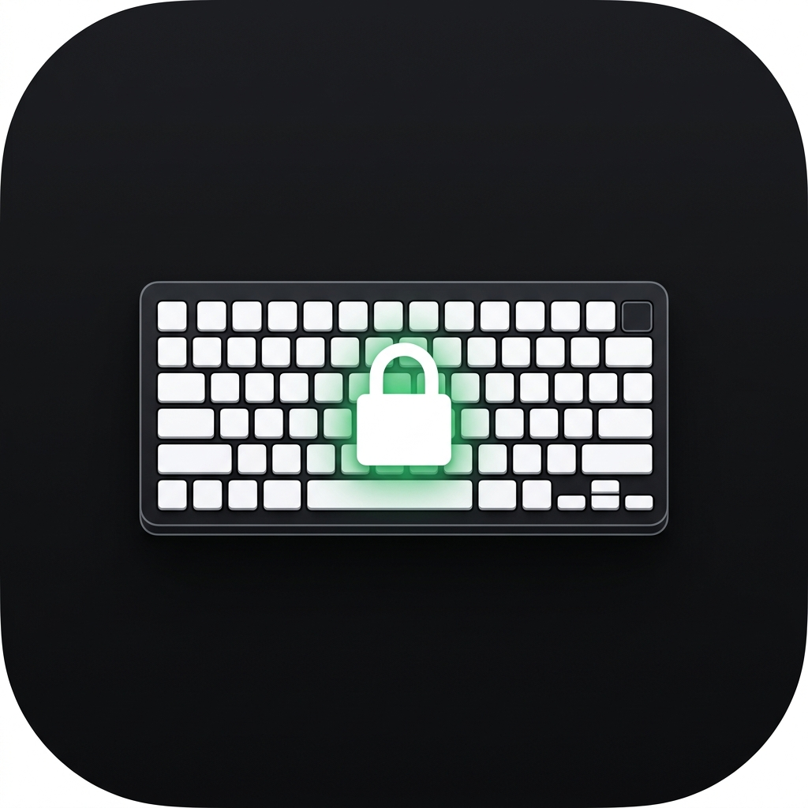

<div align="center">



# Keyboard Cleaner Pro

**A premium dark-themed Windows utility that locks your keyboard input while you clean your laptop.**

[](https://github.com/choksi2212/keyboard-cleaner-pro/releases)
[](https://github.com/choksi2212/keyboard-cleaner-pro/releases/latest)
[](LICENSE)
[](https://dotnet.microsoft.com)

[**⬇ Download Installer**](https://github.com/choksi2212/keyboard-cleaner-pro/releases/latest) · [Report Bug](https://github.com/choksi2212/keyboard-cleaner-pro/issues) · [Request Feature](https://github.com/choksi2212/keyboard-cleaner-pro/issues)

</div>

---

## Overview

**Keyboard Cleaner Pro** lets you instantly lock all keyboard input on your Windows laptop with a single click, so you can safely wipe down the keys without triggering accidental keystrokes. After a configurable timer (1–30 minutes) the keyboard automatically unlocks — or unlock it manually at any time.

> Built with a clean, premium **dark aesthetic** and zero telemetry. Your data never leaves your machine.

<br />

## Features

| Feature | Details |
|---|---|
| **Instant Lock / Unlock** | One click to block all keyboard input system-wide |
| **Auto-unlock Timer** | Configurable: 1, 2, 3, 5, 10, 15, or 30 minutes |
| **Smart Detection** | Automatically detects and identifies your internal keyboard |
| **Crash-safe Recovery** | If the app crashes, Windows automatically releases the keyboard lock |
| **Persistent Settings** | Your preferred timer duration is saved between sessions |
| **Full Audit Log** | Every lock/unlock event logged to `%ProgramData%\KeyboardCleaner\Logs` |
| **Dark Premium UI** | Custom WPF window with animated ring, no titlebar chrome |

<br />

## Download & Install

### Option 1 — MSI Installer *(Recommended)*

1. Go to the [**Releases**](https://github.com/choksi2212/keyboard-cleaner-pro/releases/latest) page
2. Download `KeyboardCleanerPro-Setup-v1.0.0.msi`
3. Double-click the installer → click through the setup wizard
4. The app is installed to `Program Files\Keyboard Cleaner Pro`
5. A **Start Menu** shortcut and **Desktop** shortcut are created automatically

### Option 2 — Build from Source

**Prerequisites:** [.NET 9 SDK](https://dotnet.microsoft.com/download/dotnet/9), [WiX Toolset v4](https://github.com/wixtoolset/wix/releases)

```powershell
git clone https://github.com/choksi2212/keyboard-cleaner-pro.git
cd keyboard-cleaner-pro

# Build
dotnet build KeyboardCleanerPro.sln --configuration Release

# Publish self-contained exe
dotnet publish src/KeyboardCleanerPro/KeyboardCleanerPro.csproj `
  --configuration Release --runtime win-x64 --self-contained true `
  -p:PublishSingleFile=true --output dist/

# Build MSI (requires WiX CLI tool)
dotnet tool install --global wix --version 4.0.5
wix extension add WixToolset.UI.wixext/4.0.5 --global
wix build installer\Product.wxs -d PublishDir=dist -b installer `
  -ext WixToolset.UI.wixext -arch x64 `
  -o installer\KeyboardCleanerPro-Setup-v1.0.0.msi
```

<br />

## How to Use

1. **Right-click** the app shortcut → **Run as administrator** *(required once per session)*
2. The app detects your internal keyboard and shows **"Keyboard Active"** with a green indicator
3. Set your preferred **auto-unlock duration** in the dropdown (bottom-right)
4. Click the **LOCK** button — the keyboard is immediately blocked
5. Clean your keys freely — no accidental input possible
6. The keyboard unlocks automatically after your timer, or click **UNLOCK** any time

> **The app window's own buttons still work** — only keyboard input from keys is blocked, not mouse clicks.

<br />

## System Requirements

| Requirement | Minimum |
|---|---|
| Operating System | Windows 10 (1903+) or Windows 11 |
| Architecture | x64 (64-bit) |
| Privileges | Administrator (required for system-wide keyboard hook) |
| Runtime | Self-contained — no .NET runtime installation needed |

<br />

## How It Works

Keyboard Cleaner Pro uses a **WH_KEYBOARD_LL** (Low-Level Keyboard Hook) — a Windows system API that intercepts all keyboard input before it reaches any application. When locked:

```
Key press → PS/2 / HID driver → Windows Input → [KCP Hook] → swallowed ✗
                                                   (blocked)

Key press → PS/2 / HID driver → Windows Input → [KCP Hook] → pass-through ✓
                                                   (unlocked)
```

This approach works on **all keyboard types** (PS/2, ACPI, HID, USB, I2C) regardless of the driver model, because it operates at the Windows input pipeline layer rather than at the device driver level.

**Crash safety:** Windows automatically removes all hooks when a process exits or crashes. Your keyboard is **always** recovered — even if the app force-quits.

<br />

## Troubleshooting

### The app doesn't start / closes immediately

**Cause:** The app requires Administrator privileges.  
**Fix:** Right-click the shortcut → **Run as administrator**. The app will prompt for UAC elevation automatically on subsequent launches.

---

### "Keyboard Active" never appears / stays on "Searching…"

**Cause:** The keyboard detection couldn't find an internal keyboard device.  
**Fix:**
- Make sure you are running on a **laptop** with a built-in keyboard (not a desktop)
- Run as Administrator (required for SetupAPI device enumeration)
- Check `%ProgramData%\KeyboardCleaner\Logs` for detailed error messages

---

### The LOCK button is grayed out / unclickable

**Cause:** The app is still in the detection phase (takes 1–2 seconds on first launch).  
**Fix:** Wait a moment — the button becomes active once the keyboard is detected and the status shows **"Keyboard Active"**.

---

### Keyboard is still blocked after clicking UNLOCK

**Cause:** Rare race condition in the hook removal.  
**Fix:**
1. Click UNLOCK again
2. If still blocked, **close the app** — Windows releases the hook automatically on exit
3. If still blocked after closing, press `Win + L` (lock screen) then log back in to reset the input stack

---

### The app crashes and the keyboard is stuck

**Cause:** Should not happen — Windows cleans up hooks on process exit.  
**Fix:** If it does happen (extreme edge case):
1. Open Task Manager (`Ctrl + Shift + Esc`)
2. Find and end any remaining `KeyboardCleanerPro` process
3. Your keyboard will immediately work again

---

### Windows Defender / Antivirus flags the installer

**Cause:** The app uses a system-level keyboard hook (`WH_KEYBOARD_LL`) which some heuristic scanners flag as keylogger-like behavior. It is **not a keylogger** — it only swallows keystrokes, never reads or transmits them.  
**Fix:**
1. The MSI installer is unsigned (no EV code-signing certificate)
2. Click **"More info"** → **"Run anyway"** in the SmartScreen dialog
3. Or build from source and inspect the code yourself

---

### The installer shows "Windows protected your PC"

**Cause:** SmartScreen blocks unsigned executables from unknown publishers.  
**Fix:** Click **"More info"** → **"Run anyway"**. The app is open-source — you can review every line of code in this repository.

---

### Log files location

All events are logged to:
```
%ProgramData%\KeyboardCleaner\Logs\kcp-YYYY-MM-DD.log
```
Share these logs when reporting a bug.

<br />

## Project Structure

```
keyboard-cleaner-pro/
├── src/
│   ├── KeyboardCleanerPro/              # WPF UI layer (MVVM)
│   │   ├── ViewModels/                  # MainViewModel, RelayCommand
│   │   ├── Converters/                  # Value converters for data binding
│   │   ├── Resources/                   # Styles.xaml, logo.png
│   │   └── MainWindow.xaml              # Main window UI definition
│   ├── KeyboardCleanerPro.Core/         # Business logic (platform-agnostic)
│   │   ├── Services/
│   │   │   ├── Control/                 # KeyboardHookControlService (WH_KEYBOARD_LL)
│   │   │   ├── Detection/               # Device enumeration via SetupAPI
│   │   │   ├── Configuration/           # JSON settings persistence
│   │   │   ├── Logging/                 # Structured audit logging
│   │   │   ├── Recovery/                # Auto-restore timer management
│   │   │   └── State/                   # Crash-safe state persistence
│   │   ├── Models/                      # KeyboardDevice, DeviceState, etc.
│   │   └── Infrastructure/Native/       # P/Invoke: SetupAPI, CfgMgr, User32
│   └── KeyboardCleanerPro.Recovery/     # Lightweight recovery agent executable
├── installer/
│   ├── Product.wxs                      # WiX v4 MSI installer definition
│   └── License.rtf                      # MIT License (displayed in setup wizard)
└── KeyboardCleanerPro.sln               # Visual Studio / dotnet solution file
```

<br />

## Privacy

- **Zero telemetry** — no analytics, no crash reporting, no network calls
- **No data collection** — the app never reads what keys are pressed; it only swallows them
- **Local logs only** — audit logs stay on your machine in `%ProgramData%\KeyboardCleaner\Logs`
- **Open source** — every line of code is publicly auditable

<br />

## License

This project is licensed under the **MIT License** — see the [LICENSE](LICENSE) file for details.

<br />

---

<div align="center">

Developed with ❤️ by **[Manas Choksi](https://github.com/choksi2212)**

*If this helped you, consider giving it a ⭐ on GitHub!*

</div>
